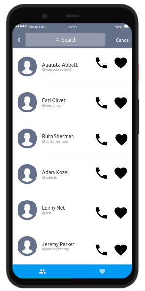

# Kotlin Test Project


## Objetivo de la prueba
El objetivo de esta prueba es conocer las buenas prácticas y forma de llevar a cabo el desarrollo de un pequeño proyecto para dispositivos móviles, específicamente para celulares con sistema *Android*, bajo el lenguaje de programación **Kotlin**.

Los requisitos básicos son los siguientes:
- Experiencia con GIT, en este caso con la plataforma github.com.
- Experiencia desarrollando aplicaciones móviles con Kotlin.
- Experiencia con arquitecturas MVVM y MVC.
- Seguir los principios SOLID
- Ejecución de test unitarios
- Experiencia en Multithreading, coroutines.
- Experiencia con Jetpack.

## Requerimientos del proyecto.

### Requisitos funcionales.
**Empresa Peroles, SA** requiere poder contactar con sus empleados de una forma rápida, para ello requiere una aplicación para celulares que se conecte al servidor de la empresa y muestre los empleados disponibles, adicionalmente el usuario de la aplicación pueda señalar a sus compañeros con quien contacta habitualmente. La aplicación debe marcar de forma automática el número telefónico del empleado deseado.

### Requisitos técnicos.
El departamento de informática de la empresa requiere técnicamente lo siguiente:
- El lenguaje de programación debe ser Kotlin.
- La lista global de empleados es obtenida por medio de un servicio REST API, cuya especificación la describiremos en la sección correspondiente *"Documentación del servicio REST API"*.
- El diseño UI debe respetar en principio lo plasmado en la imagen .
- Tomando como referencia el wireframe original, el usuario de la aplicación debe poder cambiar de vistas, de una lista global de empleados a una lista de empleados marcados como favorito.
- Los empleados de la lista global serán siempre tomados del servicio REST API, pero los empleados marcados como favoritos deben ser gestionados con la propia base de datos de Android.
- En la lista de empleados global, la paginación de los empleados se debe efectuar cuando el usuario llegue al final de la lista global, siempre cargando empleados de diez en diez.
- Eres libre de utilizar cualquier librería para el manejo de las imagenes de los empleados.
- En el desarrollo debes aplicar la arquitectura MVVM, inyección de dependencias, coroutines, ROOM y los test unitarios que consideres necesarios.
- La funcionalidad de búsqueda de empleados es opcional.
- El idioma por defecto de la aplicación es Ingles (US), pero tomad en cuenta que la mayoría de los usuarios usa el español, así que dicho idioma debe estar disponible.


### Documentación del servicio REST API.
Utilizaremos el servicio REST API que nos provee la plataforma [RANDOM USER GENERATOR](https://randomuser.me/) 

Según la documentación de la plataforma, la primera llamada es un GET a la siguiente URL:
https://randomuser.me/api/?nat=es&results=10  [Prueba](https://randomuser.me/api/?nat=es&results=10),

Los parámetros nat y results nos permiten obtener diez empleados de nacionalidad española.

Para obtener más empleados, de diez en diez, las siguientes llamadas deben ser de la así:
https://randomuser.me/api/?nat=es&results=10&page=PAGINA&seed=CODIGO_SEED

Los parámetros **page** y **seed** deben ser informados según la lógica que implementes, pero es evidente que **page** corresponde con la siguiente página a consultar y el parámetro **seed** lo debes informar tomando su valor de la primera consulta, en el objeto *JSON* de respuesta lo podemos identificar:

```
  "info": {
    "seed": "CODIGO_SEED",
    "results": 10,
    "page": ultima PÁGINA consultada,
    "version": "1.3"
  }

```

En la [Documentación oficial de la plataforma] https://randomuser.me/documentation puedes encontrar todos los detalles, inclusive puedes obtener solo la información requerida de los empleados y evitar de esta forma obtener información que no vas a usar dentro del diseño de la aplicación.

## Entrega del proyecto.
La entrega de la prueba es de la siguiente forma.
* Debes hacer *fork* de este repositorio a tu propio repositorio de github.
* Llevar a cabo todo el desarrollo en tu propio repositorio.
* Los test unitarios deben ejecutarse de forma satisfactoria.
* Cuando lo termines, debes generar un TAG con el nombre *release_1*.
* Enviarnos al correo la URL del TAG generado, con el asunto: **[ENTREGA] Android Developer (Kotlin)**.


## Notas.
* No hay limite de tiempo para la entrega del proyecto, pero no dejes que se te adelanten.
* Si no te gustan los comentarios en el código, no tienes porque escribirlo, pero no esta demas alguno que otro.
* Nos gusta los *"fragments"* y el código reutilizable.
* Si tienes alguna duda sobre los requerimientos, envíanos un correo con el asunto: **[DUDA] Android Developer (Kotlin)**.


